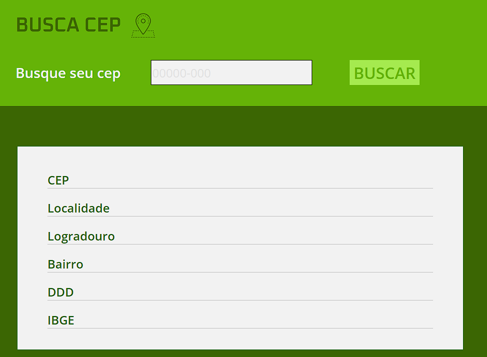

# SOURCE CEP :world_map:

Site para procurar dados do endereço de um cep, com o uso de API.

## :warning: Concluído :white_check_mark:

### :clipboard: Pré requisitos

Para a utilização é necessário somente um navegador web e conexão com a internet.

### :rocket: Como usar

- Acesse o link: https://sourcecep.netlify.app/

### :camera: Capturas de tela

### :desktop_computer: :pen: Construído com

- HTML, CSS, Javascript

### :fountain_pen: Autor

<a href="https://www.linkedin.com/in/fabiano-cavalcante-99811221a/">Fabiano Cavalcante</a>